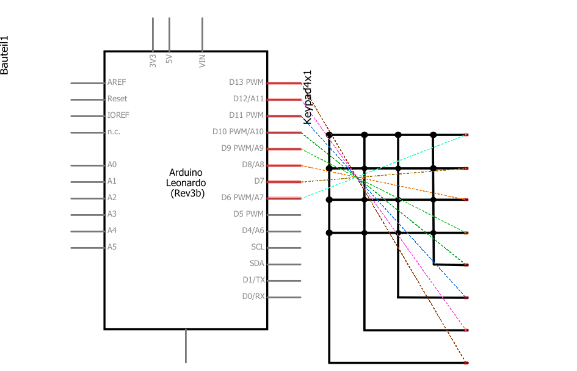

# 🗺 Arduino Leonardo

<figure><figcaption>
Steckplatine Arduino Leonardo | Tastenfeld - Modul
</figcaption></figure>

<figure><figcaption>
Schaltplan Arduino Leonardo | Tastenfeld - Modul
</figcaption></figure>

