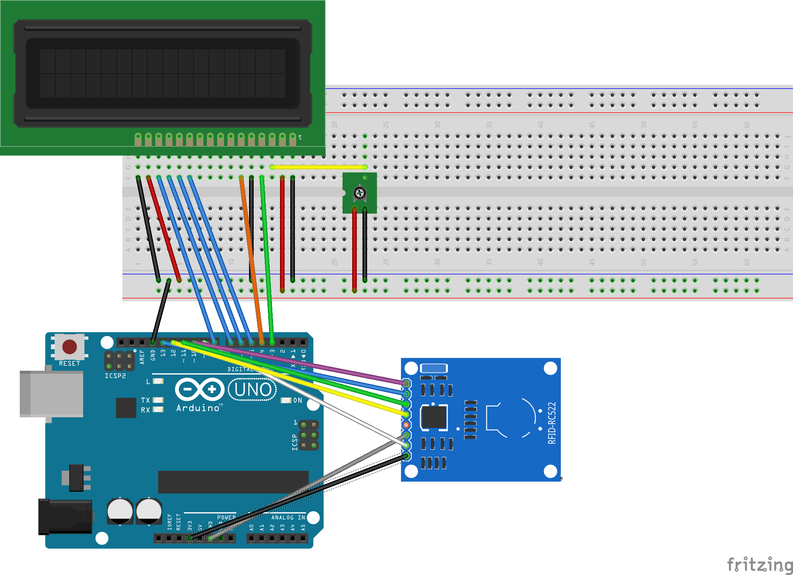
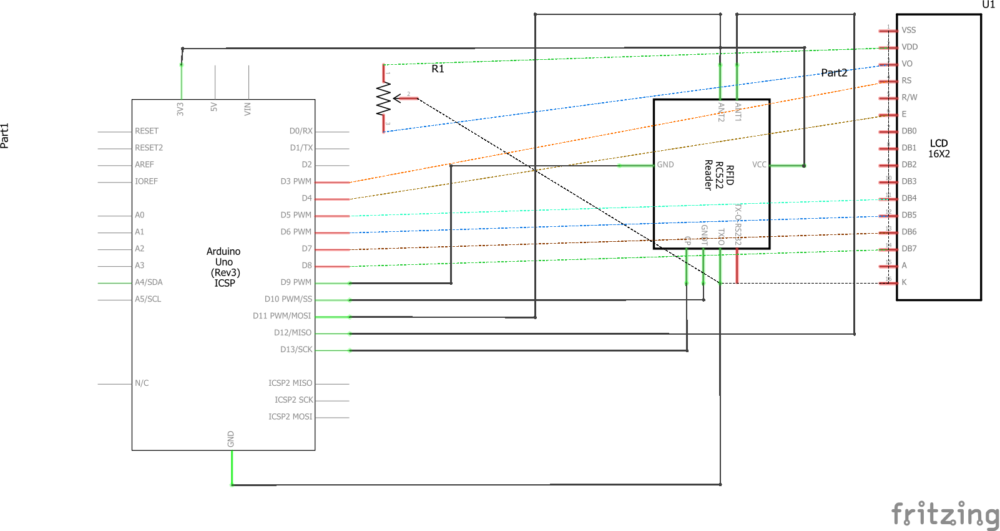

# 🗺 Arduino Uno R3

<figure><figcaption>
Steckplatine Arduino Uno R3 | RFID &#x26; LCD Display
</figcaption></figure>

<figure><figcaption>
Schaltplan Arduino Uno R3 | RFID &#x26; LCD Display
</figcaption></figure>

